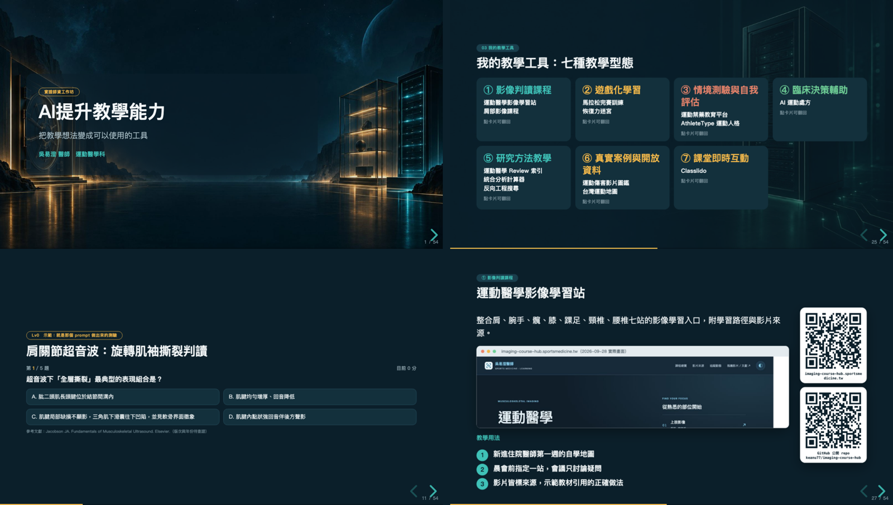

<div align="center">

# htmlpptskill

**跟 AI 說一句「做一份 HTML 簡報」，拿到能離線播、QR 驗過、還附講義 PPTX／PDF 的成品。**

reveal.js 簡報製作流程，包成兩個 Agent Skill。<br>
Claude Code・Codex CLI・Gemini CLI・Grok Build 都能裝。

[](https://github.com/keanu77/htmlpptskill/actions)
[](LICENSE)




<sub>實際講座成品：封面 GSAP 逐字浮現、七張卡片一次翻面、頁內真的能作答的測驗、網站＋repo 雙 QR。54 頁、3 MB、拔掉網路照樣播。</sub>

</div>

---

## 為什麼不用 PowerPoint 就好？

| 你遇過的事 | 這個 repo 的做法 |
|---|---|
| 會場沒網路，簡報裡的字型、圖、外掛全部掛掉 | 交付前 `QA_OFFLINE=1` 跑一次：任何對外請求都算失敗，reveal.js、字型、圖片、QR 全內嵌成**單一 HTML** |
| QR 印錯，台下掃到 404 | QA 會把每張 QR **逐張截圖解碼**，跟你寫的網址比對，不符就 exit 1 |
| AI 產的投影片文字溢出、少講者備註，播到一半才發現 | 逐頁截圖拼成一張 `montage.png`，溢出、JS 錯誤、缺備註一次列出 |
| 主辦單位要 PPTX，你只有 HTML | `render-slides` → `build-handout`：一頁一圖的 PPTX，講者備註進備忘稿；PDF 一行指令 |
| 想要「炫一點」但怕翻車 | 效果 skill 分穩重／中間／驚豔三檔，內建減少動態效果與 QA 靜態模式 |
| 講者在 PPTX 上手改了字，改動回不去 HTML | 附完整實例：從 PPTX 抽文字、解 QR 圖、回灌 HTML |

## 兩個 skill

| Skill | 一句話 | 什麼時候會被觸發 |
|---|---|---|
| **`html-slide-deck`** | 從大綱到交付的主流程：版型、圖片、QR、互動頁、逐頁 QA、講義 PPTX／PDF、原生可編輯 PPTX | 「做一份 HTML 簡報」「reveal.js」「簡報加截圖／QR」「轉 PPT／講義」「離線簡報」 |
| **`html-slide-effects`** | 加在其上的效果：逐步出現、Auto-Animate、3D 翻卡、GSAP 逐字、計時條、點圖放大、手機捲動 | 「加動畫」「卡片翻面」「讓簡報更生動」「有什麼效果可以加」 |

## 30 秒安裝

```bash
git clone https://github.com/keanu77/htmlpptskill.git && cd htmlpptskill
./install.sh                # 偵測到哪個 CLI 就裝哪個；既有同名 skill 先搬到 skills-backup/
```

| 你的 CLI | 裝到哪 | 之後怎麼叫 |
|---|---|---|
| **Claude Code** | `~/.claude/skills/` | 輸入 `/` 看到 `/html-slide-deck`，或直接說「做一份 HTML 簡報」。也可當 plugin：`/plugin marketplace add keanu77/htmlpptskill` → `/plugin install htmlpptskill@keanu77` |
| **Codex CLI** | `~/.codex/skills/` | 直接描述任務，或 `$html-slide-deck` |
| **Gemini CLI** | `~/.gemini/skills/` | `gemini skills list` 確認；或 `gemini skills link <repo>/skills/html-slide-deck` |
| **Grok Build** | `~/.grok/skills/` | 直接描述任務（它也會讀 `~/.claude/skills/`） |

只裝一家：`./install.sh codex`。跟專案一起 commit：`./install.sh --project`（裝到 `.agents/skills/`，三家都掃）。

<details>
<summary><b>腳本要用的東西</b>（第一次裝好就不用再管）</summary>

```bash
npm i -D playwright && npx playwright install chromium   # 截圖 QA、講義渲染、PDF；Linux 無 GUI 再加 install-deps
npm i -g pptxgenjs                                        # 圖片型講義與原生 PPTX
python3 -m pip install -r requirements.txt                # segno、pillow、python-pptx（建議 venv）
```
腳本從**執行目錄往上**找 `node_modules`，找不到再找 npm 全域；也可設 `SKILL_PKG_ROOT`。

| 平台 | 支援 |
|---|---|
| macOS | 全功能（`pptx-to-pdf.sh` 需要 Microsoft PowerPoint） |
| Linux | 全功能，除了 PowerPoint 原生匯出（PDF 改用 `print-pdf.mjs`）；無 GUI 主機要裝中文字型（Noto Sans CJK） |
| Windows | 腳本用 `node` 直接跑；`install.sh` 用 WSL 或手動複製 `skills\*`；`python3` 通常是 `python`（設 `PYTHON=python`） |
</details>

## 10 分鐘看到第一份成品

```bash
mkdir my-deck && cd my-deck && npm init -y
npm i -D playwright && npx playwright install chromium && npm i reveal.js@5 pptxgenjs
SKILL=~/.claude/skills/html-slide-deck                       # 換成你的 CLI 的路徑

cp $SKILL/references/reveal-template.html draft.html         # 9 頁範本，〈…〉與 example.com 都是占位
node $SKILL/scripts/inline-assets.mjs draft.html index.html  # 內嵌 reveal.js 與圖片 → 離線單檔
QA_OFFLINE=1 node $SKILL/scripts/qa-screenshots.mjs index.html qa/     # 逐頁截圖、QR、溢出 → 看 qa/montage.png
node $SKILL/scripts/render-slides.mjs index.html render/
node $SKILL/scripts/build-handout.mjs render/ handout.pptx "講者"       # 圖片型講義（備註進備忘稿）
node $SKILL/scripts/print-pdf.mjs index.html handout.pdf               # PDF 講義
```

或者什麼都不打，直接跟 agent 說：

> 用 html-slide-deck 做一份 20 頁的「XXX」簡報，聽眾是住院醫師，會場沒網路，每個工具頁放 QR。

它會先給你大綱表等你確認，再產 HTML、跑 QA、交付三種檔案。

## 流程長什麼樣

```
問三件事（觀眾／有沒有網路／要不要特效）→ 大綱表（等你確認）
  ├─ A 單檔手寫（≤25 頁）      references/reveal-template.html → inline-assets.mjs
  └─ B 內容／版型分離（>25 頁） references/offline-build-template/：content.js 一頁一個物件 → npm run all
圖片：AI 底圖（任何生圖工具）、Playwright 真實截圖、segno QR（每張 .qrcard 帶 data-url）
QA：qa-screenshots.mjs ─ 截圖、溢出、JS 錯誤、對外請求、QR 逐張解碼比對、montage.png ─ 有問題 exit 1
交付：index.html（單檔）＋ 講義 PPTX ＋ PDF（＋ 原生可編輯 PPTX）
效果：html-slide-effects → 加完回頭重跑 QA
```

<details>
<summary><b>做法 B 的範本裡有什麼</b></summary>

- `content.js`：8 頁中性起手，一頁一個物件（`type` 決定版型、`notes` 是備註）。50 頁完整實例在 `examples/workshop-2026/`，複製過來就能 build。
- `build.js`：25 種版型的渲染函式（封面、章節、三卡、流程、階梯、prompt、平台優缺點、比較表、決策樹、工具頁＋大 QR、資源頁…）。
- `scripts/check.mjs`：頁數對 content.js、溢出、JS 錯誤、對外請求、QR 逐張解碼。
- `PLAN.md`＋`ROLE-AUTHOR.md`／`ROLE-REVIEWER.md`：想讓兩個 agent 一個主筆一個稽核，角色由你指定。
</details>

## 效果一覽（html-slide-effects）

| 風格 | 用哪些 | 適合 |
|---|---|---|
| 穩重 | fragment 逐步出現、章節 zoom、計時條、點圖放大、頁內小測驗 | 醫學、學術、教學 |
| 中間 | ＋ 3D 翻卡、GSAP 封面與收尾逐字 | 工作坊、內訓 |
| 驚豔 | ＋ Three.js 封面、卡片牆飛入、Spotlight | 發表會、開幕 |

每一種都附「怎麼在 QA 截圖與 PDF 時關掉」的 STATIC 開關，以及 `prefers-reduced-motion` 退路。

## 這些規矩是踩過雷才寫的

- **大綱先確認再寫 HTML。** AI 一口氣產 50 頁再改，比先對齊大綱貴十倍。
- **QA 必做、要看圖。** `montage.png` 先看，有標記的頁再看大圖；改完至少再驗一輪。
- **每張 QR 都要 `data-url`。** 沒有它 QA 比對不了，占位網址（example.com）會被警告。
- **會場當作沒網路。** 交付前 `QA_OFFLINE=1`；字型走系統堆疊，不下載 Google Fonts。
- **部署、開 repo 前一定先問。** skill 不會自己把東西推到公網。
- **QA 腳本會執行簡報裡的 JavaScript。** 只對自己產生的 HTML 跑。

## 目錄

```
skills/
  html-slide-deck/
    SKILL.md                      主流程（給 agent 讀）
    scripts/                      qa-screenshots、render-slides、build-handout、print-pdf、inline-assets、
                                  resolve、montage.py、pptx-to-pdf.sh（macOS）、gen-image.sh（可換生圖工具）
    references/
      reveal-template.html        深色版型：chip／card／grid／steps／mock／qrcard／viz／互動頁（reveal.js 5.2）
      offline-build-template/     做法 B：content.js＋build.js＋check.mjs＋PLAN.md＋角色檔
      pptxgenjs-helpers.mjs       原生 PPTX 的 theme 與 helper（＋ native-pptx-example.mjs）
      pitfalls.md                 踩過的雷與可複用片段
  html-slide-effects/SKILL.md
examples/
  workshop-2026/content.js        50 頁工作坊完整內容
  pptx-edits-back-to-html.py      講者在 PPTX 手改後回灌 HTML＋全部效果的實例（見 examples/README.md）
docs/                             成果圖
.claude-plugin/                   Claude Code plugin／marketplace 設定
AGENTS.md、CLAUDE.md              給在本 repo 工作的 agent
```

## 疑難排解

| 現象 | 處理 |
|---|---|
| `找不到套件 playwright` | 在有 `node_modules` 的專案目錄執行，或 `npm i -g playwright`，或設 `SKILL_PKG_ROOT` |
| `缺 jsqr／pngjs` | 到 skill 目錄 `npm install`；或 `QA_SKIP_QR=1` 明確略過 |
| Chromium 沒下載 | `npx playwright install chromium`；已有 Chromium 就設 `CHROMIUM_PATH` |
| 截圖中文變方框（Linux） | 裝 Noto Sans CJK |
| PubMed 等站對 headless 回 403 | 請使用者提供截圖，或用 CLI 內建瀏覽器工具（若有） |
| `osascript -9074`／逾時 | `pptx-to-pdf.sh` 會重試一次；首次要在螢幕前允許「自動化」；SSH 無法用 |
| PDF 頁數比投影片多 | `Reveal.initialize` 加 `pdfSeparateFragments: false`（範本已設） |

## 來歷

作者是運動醫學科醫師，2026-09 為臨床教師工作坊做了 24 頁附錄與 54 頁主簡報，把過程寫成 skill，再請 Codex、Claude、Grok、Gemini 四個模型審一輪（結果在 [CHANGELOG](CHANGELOG.md)）。範本裡的示例內容屬作者，換成你自己的。

## 授權

程式碼與腳本 MIT。範本與 `examples/` 的示例文字、網址、截圖僅供替換參考；第三方字型與外掛請自行確認授權。

---

<details>
<summary><b>English summary</b></summary>

Two Agent Skills (open `SKILL.md` format) for building **reveal.js HTML slide decks** with an AI coding agent, plus the scripts that make them trustworthy:

- **html-slide-deck**: outline-first workflow, dark professional template, real screenshots, QR codes, interactive pages, per-slide screenshot QA (overflow, JS errors, external requests, **QR decoded and compared with `data-url`**), export to handout PPTX (notes included), PDF, and native editable PPTX.
- **html-slide-effects**: fragments, Auto-Animate, 3D flip cards, GSAP, timer bar, lightbox, scroll view, with reduced-motion and a STATIC switch so QA screenshots and PDFs capture the final state.

Works with Claude Code, OpenAI Codex CLI, Gemini CLI and Grok Build (`./install.sh` detects them). Docs are in Traditional Chinese; the scripts and templates are language-neutral.
</details>
