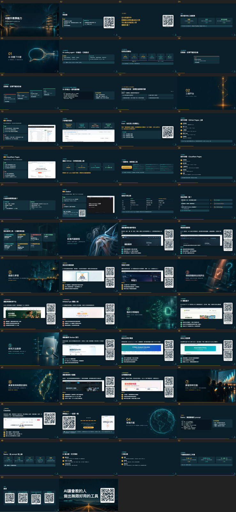

# htmlpptskill

用 AI coding agent 做 **reveal.js HTML 簡報**，逐頁 QA（含 QR 驗證），再轉成**講義 PPTX／PDF**。
兩個 Agent Skill（`SKILL.md` 開放格式）、一套腳本、一份可直接跑的離線範本，全部來自實際講座踩過的雷。
支援 **Claude Code、OpenAI Codex CLI、Gemini CLI、Grok Build**。

*English: two Agent Skills (SKILL.md standard) plus scripts for building reveal.js HTML decks with an AI coding agent, screenshot-based QA with QR verification, and export to handout PPTX/PDF. Works with Claude Code, Codex CLI, Gemini CLI and Grok Build. Docs are in Traditional Chinese.*



| Skill | 管什麼 |
|---|---|
| `html-slide-deck` | 簡報本體：大綱確認 → 版型 → 圖片與 QR → 互動頁 → 逐頁 QA（溢出、JS 錯誤、對外請求、QR 逐張解碼比對）→ 講義 PPTX／PDF／原生可編輯 PPTX |
| `html-slide-effects` | 加在其上的效果：fragment、Auto-Animate、3D 翻卡、GSAP、計時條、點圖放大、手機捲動模式，以及效能、減少動態效果、離線守則 |

## 安裝

```bash
git clone https://github.com/keanu77/htmlpptskill.git
cd htmlpptskill
./install.sh            # 偵測到哪個 CLI 就裝到它的使用者層級 skills 目錄；既有同名目錄先搬到 skills-backup/
./install.sh codex      # 只裝給某一家：claude | codex | gemini | grok
./install.sh --project  # 裝到目前專案的 .agents/skills/（Gemini、Grok、Codex 都會掃，可跟專案一起 commit）
```

| CLI | 安裝位置 | 觸發方式（以各家文件為準） |
|---|---|---|
| Claude Code | `~/.claude/skills/` | 輸入 `/` 看自動完成，或直接說「做一份 HTML 簡報」；也可當 plugin：`/plugin marketplace add keanu77/htmlpptskill` → `/plugin install htmlpptskill@keanu77` |
| Codex CLI | `~/.codex/skills/` | 直接描述任務，或輸入 `$html-slide-deck` |
| Gemini CLI | `~/.gemini/skills/` | `gemini skills list` 確認；或 `gemini skills link <repo>/skills/html-slide-deck` |
| Grok Build | `~/.grok/skills/`（也讀 `~/.claude/skills/`） | 直接描述任務 |

其他需求（腳本從**執行目錄往上**找 `node_modules`，找不到再找 npm 全域，也可設 `SKILL_PKG_ROOT`）：

```bash
npm i -D playwright && npx playwright install chromium    # 截圖 QA、講義渲染、PDF；Linux 無 GUI 再加 install-deps
npm i -g pptxgenjs                                         # 圖片型講義與原生 PPTX
python3 -m pip install -r requirements.txt                 # segno、pillow、python-pptx（建議 venv）
```

| 平台 | 支援 |
|---|---|
| macOS | 全功能（`pptx-to-pdf.sh` 需要 Microsoft PowerPoint） |
| Linux | 全功能，除了 PowerPoint 原生匯出；PDF 改用 `print-pdf.mjs`；無 GUI 主機要裝中文字型（如 Noto Sans CJK） |
| Windows | 腳本可在 PowerShell 以 `node` 執行；`install.sh` 請用 WSL 或手動複製 `skills\*` 到各 CLI 的 skills 目錄；`python3` 通常是 `python`（設 `PYTHON=python`） |

## 10 分鐘上手

```bash
mkdir my-deck && cd my-deck && npm init -y
npm i -D playwright && npx playwright install chromium && npm i reveal.js@5 pptxgenjs
SKILL=~/.claude/skills/html-slide-deck            # 換成你的 CLI 的路徑

cp $SKILL/references/reveal-template.html draft.html      # 改內容（〈…〉與 example.com 都是占位）
node $SKILL/scripts/inline-assets.mjs draft.html index.html   # 內嵌 reveal.js 與圖片 → 離線單檔
QA_OFFLINE=1 node $SKILL/scripts/qa-screenshots.mjs index.html qa/   # 逐頁截圖、QR、溢出；看 qa/montage.png
node $SKILL/scripts/render-slides.mjs index.html render/
node $SKILL/scripts/build-handout.mjs render/ handout.pptx "講者"     # 圖片型講義（備註進備忘稿）
node $SKILL/scripts/print-pdf.mjs index.html handout.pdf             # PDF 講義
```

超過 25 頁、要多輪改稿：改用做法 B，複製 `$SKILL/references/offline-build-template/`，填 `PLAN.md` 與 `content.js`，`npm install && npm run all`。

## 流程

```
問觀眾／網路／要不要特效 → 大綱表（等確認）
  ├─ A 單檔手寫（≤25 頁）：references/reveal-template.html → inline-assets.mjs
  └─ B 內容／版型分離（>25 頁、離線、多輪改稿）：references/offline-build-template/
        content.js（一頁一個物件）＋ build.js（每種 type 一個渲染函式）→ npm run all → dist/index.html
圖片：AI 底圖（≤1600 寬轉 JPG）、Playwright 真實截圖、segno QR（每張 .qrcard 加 data-url）
QA：qa-screenshots.mjs ← 逐頁截圖、JS 錯誤、溢出、對外請求、QR 逐張解碼比對、montage.png；有問題 exit 1
講義：render-slides.mjs → build-handout.mjs（圖片型 PPTX）｜print-pdf.mjs（PDF）｜pptxgenjs-helpers.mjs（原生可編輯）
效果：載入 html-slide-effects，加完回頭重跑 QA
```

## 目錄

```
skills/
  html-slide-deck/
    SKILL.md                      主流程（給 agent 讀）
    package.json                  jsqr、pngjs（QR 解碼）
    scripts/
      qa-screenshots.mjs          逐頁 QA＋QR 解碼＋montage；QA_OFFLINE／QA_SKIP_QR／QA_FRAGMENTS
      render-slides.mjs           逐頁 JPEG（1280×720 ×1.5）＋meta.json
      build-handout.mjs           圖片型講義 PPTX
      print-pdf.mjs               ?print-pdf → PDF
      inline-assets.mjs           CDN 範本 → 內嵌 reveal.js 與圖片的離線單檔
      resolve.mjs                 套件解析、file URL、Reveal 就緒等待、垂直子頁
      montage.py                  contact sheet
      pptx-to-pdf.sh              PowerPoint 原生匯出（macOS）
      gen-image.sh                生圖（預設 Codex CLI，可用 GEN_CMD 換）
    references/
      reveal-template.html        深色版型：chip／card／grid／steps／mock／qrcard／viz／互動頁（reveal.js 5.2）
      offline-build-template/     做法 B：8 頁起手 content.js、build.js、check.mjs、PLAN.md、ROLE-AUTHOR／REVIEWER.md
      pptxgenjs-helpers.mjs       原生 PPTX 的 theme 與 helper
      native-pptx-example.mjs     原生 PPTX 最小範例
      pitfalls.md                 踩過的雷與可複用片段
  html-slide-effects/SKILL.md
examples/
  workshop-2026/content.js        50 頁工作坊完整內容（做法 B 實例）
  pptx-edits-back-to-html.py      實例：講者在 PPTX 手改後回灌 HTML＋全部效果（見 examples/README.md）
docs/montage-example.png          成果示例
.claude-plugin/                   Claude Code plugin／marketplace 設定
AGENTS.md、CLAUDE.md              給在本 repo 工作的 agent
```

## 幾條硬規矩

- 大綱先確認再寫 HTML；QA 必做且要看 `montage.png`；改完至少再驗一輪。
- 會場可能沒網路：交付前 `QA_OFFLINE=1` 跑一次 QA（對外請求即失敗）。
- 每張 `.qrcard` 都要 `data-url`，QA 逐張解碼比對，QR 錯了會被抓到；占位網址會被警告。
- 醫學／學術場預設穩重：fragment 與章節 zoom 就好，3D 與 GSAP 放在封面、章節、核心概念、收尾四到五處。
- 部署（Cloudflare Pages 等）前先問；不自動開公開 repo。
- QA 腳本會執行簡報裡的 JavaScript，只對自己產生的 HTML 跑。

## 疑難排解

| 現象 | 處理 |
|---|---|
| `找不到套件 playwright` | 在有 `node_modules` 的專案目錄執行，或 `npm i -g playwright`，或設 `SKILL_PKG_ROOT` |
| `缺 jsqr／pngjs` | 到 skill 目錄 `npm install`；或 `QA_SKIP_QR=1` 明確略過 |
| Chromium 沒下載 | `npx playwright install chromium`；已有 Chromium 就設 `CHROMIUM_PATH` |
| 截圖中文變方框（Linux） | 裝 Noto Sans CJK 等中文字型 |
| PubMed 等站對 headless 回 403 | 請使用者提供截圖，或用 CLI 內建瀏覽器工具（若有） |
| `osascript -9074`／逾時 | `pptx-to-pdf.sh` 會重試一次；首次要在螢幕前允許「自動化」權限；SSH 無法用 |
| PDF 頁數比投影片多 | `Reveal.initialize` 加 `pdfSeparateFragments: false` |

## 授權

程式碼與腳本 MIT。`examples/`、範本裡的示例文字與網址屬作者，僅供替換參考；範例截圖、第三方字型與外掛請自行確認授權。
